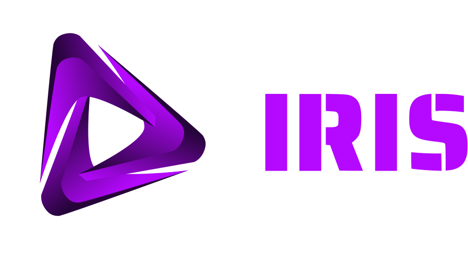

    

**IRIS** is an **AI assistant** built with modern **Front-End** technologies and powered by the **Ollama API** using the **Llama 3.2** language model.

---

### IT Features

- Voice interaction;
- Animated messages;
- Support for **3 languages:**:
    - 🇧🇷 Portuguese;
    - 🇺🇸 English;
    - 🇪🇸 Spanish.

---

### Stacks

  
  
  
  
  
  
  
  
  
  
  
  
  

---

### About Íris

> **IRIS** is **not affiliated with** or **endorsed by Ollama**. 
> **Ollama** is used as the local runtime for executing the language model.

- AI Runtime: Ollama;
- Model: Llama 3.2;
- Local Interface;
- Privacy-first architecture.

---

### Official Links

- Ollama: [https://ollama.com/](https://ollama.com/ "Click to Access");
- Llama 3.2: [https://ollama.com/library/llama3.2](https://ollama.com/library/llama3.2 "Click to Access").
